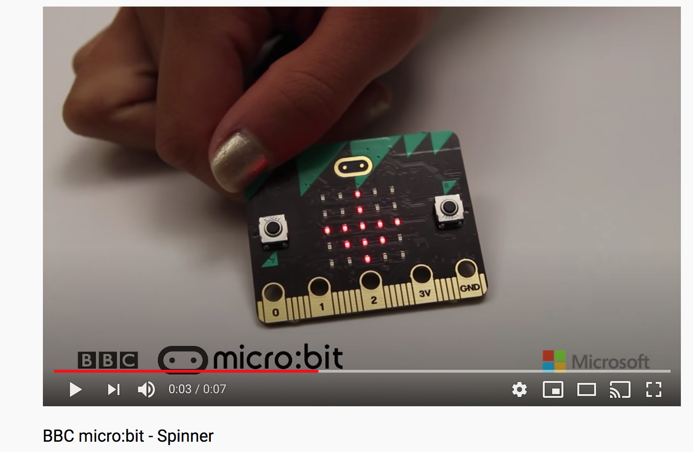

# 1701QCA Making Interaction - Assessment 2 workbook

## Project working title ##
*HIIT roulette* 

## Related projects ##
*Find about 6 related projects to the project you choose. A project might be related through  function, technology, materials, fabrication, concept, or code. Don't forget to place an image of the related project in the appropriate folder and insert the filename in the appropriate places below. Copy the markdown block of code below for each project you are showing.*

### Related project 1 ###
*Microbit Spinner*

[https://www.youtube.com/watch?v=iFgQl15hf8g](https://www.youtube.com/watch?v=iFgQl15hf8g)

This project is related to mine because *it includes similar codes of what I want to accomplish.*
These being:
* Having the code start "on shake" 
* Display arrows that change its direction
What differs is that I would like to manipulate the code/concept so that my arrow spins "on shake" instead of randomly change its direction when shake.

### Related project 2 ###
*Microbit RGB LED BOX*

[https://www.youtube.com/watch?v=uzihlj-oWxI](https://www.youtube.com/watch?v=uzihlj-oWxI)

This project is related to mine because *although I don't know the code, the function of this project is something i brainstormed and a minor function I want in my project, that projects a certain colour on LED at the press of a button. A design choice I aim to implement.*

### Related project 3 ###
*Microbit Roulette Game*

[https://www.youtube.com/watch?v=Wl01t95j338](https://www.youtube.com/watch?v=Wl01t95j338)

This project is like mine because *It includes the function/code to spin which my project will include.*

### Related project 4 ###
*Lucky Roulette*

[https://www.microbitmagazine.com/Project/24](https://www.microbitmagazine.com/Project/24)

This project is like mine because *it has the same design concept and was used a inspiration to adapt mine off. The project has it's own intent and instruction of use which differ from mine.*

### Related project 5 ###
*Microbit step counter* 

[https://www.element14.com/community/community/stem-academy/microbit/blog/2018/09/18/project-bbc-microbit-fitness-tracker-aka-step-counter](https://www.element14.com/community/community/stem-academy/microbit/blog/2018/09/18/project-bbc-microbit-fitness-tracker-aka-step-counter)

This project is like mine because *it's concept is based around the field of fitness like mine. This project also uses the "on shake" input to initiate the number to start it's counter.*

### Related project 6 ###
*Traffic Light*

[https://makecode.microbit.org/v0/76087-58205-48910-18323](https://makecode.microbit.org/v0/76087-58205-48910-18323)

This project is like mine because *it displays light after a count down, a function I am to include in mine, where it counts down someone doing an exercise and signals "Stop" and "Go" once done or before doing it.*

## Other research ##

### *How to solder and sync LED RGB lights to a microbit. As a store bought LED strip light is too long, I'd have to cut it which removes the battery adapter at the end, this teaches me how to use jumper leads and how to use solder to connect it back with my cutted piece* ###

[https://www.youtube.com/watch?v=1PhghS_-NYc](https://www.youtube.com/watch?v=1PhghS_-NYc)

### *This research was done prior to writing a material list and was in the planning process, I found this video when I thought of including and LCD screen in my project. This showed me how to code it, and also noted an important factor that the microbit coding software only provides exstensions for the 1602 LCD screen specifically. Which allowed me to specify and finalise the size of the LCD screen for it to be capatible for me.* ###

[https://www.youtube.com/watch?v=oov5Q48V844](https://www.youtube.com/watch?v=oov5Q48V844)

## Conceptual progress ##

### Design intent ###
*A fun fitness coach that challenges and tests you fitness capabilities.*

### LED running coach ###
*A suicide drill lined with led stripes. It will randomly light up a cone that is placed in variations of distance that you must race to, challenging one's reaction time.*

### Punch Count ###
*Boxing pad/bag that counts the number of punches one makes in a certain amount of time, to increase difficulty, there will be multiple rounds of which it limits or challenges you. E.g. one round will only allow you to kick or introduce rest where you can't hit or else the round is over.*

### Roll with it (4th concept) ###
*An Interactive giant cube, that when tossed or rolled will project or announce an exercise/activity and how many reps must be done. The first to finish will have to race to the cube (placed centered between participants) and hit the button to signal them finishing first.*

# Shape ideas #

### HIIT Roulette ###
* Aesthically will look like a roulette board, however the concept of a roulette is shown through the microbit, programmed to spin when shaken or when a button is pressed and to stop when button is pressed showing what exercise the person is going to do next, also have a timer of some sort.*

*This image below shows that I took the concept of my concept "Roll with it" and adapted it into a roulette form instead of a cube. I did this because my concept and goals for the "Roll with it concept", seemed unrealistic in regards to fitting the time frame, my experience and knowledge around coding and building.*

### Interaction flowchart ###

## Physical experimentation documentation ##

*My initial goal was to have the code begin at the shake of the roulette, which proved to be successful. However, given much thought, I considered the functionality and the relevenace of this when being used. Putting myself in the shoes of someone who would use this for exercise, I asked myself the question, "would I have having to shake it after every exercise annoying or at all useful?". I found that having to stop and make such an effort to shake the product after each round would kill my momentum in exercising*

* The code shows me changing the input from 'on shake' to 'on button A' to hopefully aim for efficiency and effective userbility in the design*

#### Watch Demonstration Video here ####
[https://youtu.be/NbWZddA8jfQ](https://youtu.be/NbWZddA8jfQ)

### Materials list ###

## Design process discussion ##
*Discuss your process in getting to this point, particularly with reference to aspects of the Double Diamond design methodology or other relevant design process.*

### Process photos ###
       

## Discussion ##
*The first probem I had to tackle was brainstorming an idea for a design. This however was done in our classes through discussions boards.* 

*In reference to the 'Discover' process of of the Double Diamond design, my final intent and concepts were formed based on the issues of covid19. That being an essential topic of what can we do or what could help in this time of need, mentally and/or socially? From this moved me forward to the 'Define' process. Where I hold an interest and a lot of knowledge in sport and fitness which is a great idea to go off on as this something to practice since going outside is restricted and we are locked down in our own houses. Once forming an intent, I went forward to creating concepts for the 'developing process'.*

*In my design process,as explained, the overall concept of my final design was an adaptation from the 'Roll with it' concept. At the very start of this design journey, the cube design fell favourite to me. However, over time I continued to think over and consider the realistic results for the final perfected design. Base on my little knowledge to the field and the time frame of about 4-5 weeks to put it all together, I thought it was best to simplify the idea so that it would simplify the process and funds. I also wanted to find another shape idea as I felt there was always going to be the complication of making the displayed exercise viewable from all angles if it were a cube, cylinder, ball and to somehow have that gurantee and reassurance in the design process that it won't flip the wrong way.* 

*In terms of coding, like I sidad before I initially wanted to put the input 'on shake' but for the time being it seemed better to just have a button for the input.* 

*The physical design process was overall successfull, however measurements need to be perfected. The calculations were wrong so trims had to be made for the pieces going around, roughly 62.8cm (as seen) down to approx 40cm.*

*Another minor issue was the division of the exercises on the circle. There is only so little or far the arrow can ago in between spins, so it does not accompany the amount of triangles on the circle.*

*For the perfected design I had bought, precut wood round placemats that are 25cmx25cm. For the main material of the final project.*

## Next steps ##
* Purchase an 1602 LCD screen in hopes of displaying "Go", "Ready" and the reps for each exercise.
* Learn how to code for LED RGB strips, along with this is cutting the strips and using solder to be able to connect and pair with the microbit. The LED will act as a signal, green for "GO" and red for "stop". I do not know if i am able to achieve this but I already had LED strips on hand and would like to add it as an aesthetic feature.
* Finalise how many triangles will work with how the arrow spins.
* Create or add foldable legs to the back so that it can sit up right and be viewed at a good angle for users. 
* An alternative that I brainstormed was adding a magnetic strip to the back to hang of metal surfaces. 

